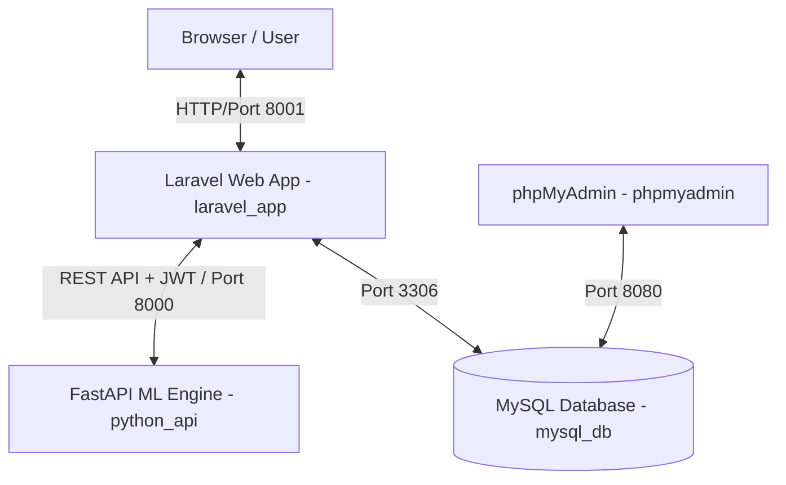

# REVORA (Revenue Estimation, Visualization, Optimization, Reporting, and Analytics)

Sistem Prediksi & Optimasi Pendapatan Retribusi Parkir Dinas Perhubungan Kota Cirebon menggunakan metode **Support Vector Regression (SVR)** yang dioptimasi dengan dua metode pencarian hyperparameter, yaitu **Grid Search** (metode exhaustif/diskrit) dan **Grey Wolf Optimizer (GWO)** (metode metaheuristik meta-populasi).

Sistem ini dikembangkan menggunakan arsitektur terpisah (**decoupled / three-tier architecture**) yang membagi tanggung jawab secara jelas antara:
*   **Web Application & Auth Provider (Laravel 13 + Apache)**: Mengelola otentikasi multi-role, pencatatan master data, visualisasi dashboard, dan pelaporan ekspor (PDF/Excel).
*   **Computational Machine Learning Engine (FastAPI + Python 3.10)**: Menangani preprocessing data, pelatihan model SVR, proses pencarian parameter optimal, dan penyimpanan berkas model biner (`.pkl`).
*   **Database Server (MySQL 8.0)**: Penyimpanan persisten untuk semua data transaksi parkir, data juru parkir, konfigurasi parameter, dan hak akses pengguna.

Komunikasi data terintegrasi antar-layanan ini dilakukan melalui protokol **HTTP REST API** yang dilindungi menggunakan **API Key** keamanan dan tanda tangan **JWT (JSON Web Token)** dengan sesi aktif selama 6 jam.

---

## 🏗️ Arsitektur Sistem

Sistem ini terdiri dari 4 layanan utama yang dijalankan secara terintegrasi menggunakan Docker:



1. **Frontend & Auth Provider (Laravel 13 + Apache)**:
   Mengelola autentikasi multi-role (Operator, Kepala UPT, Kepala Dishub), pencatatan master data, visualisasi dashboard, dan pelaporan (PDF/Excel).
2. **Machine Learning Engine (FastAPI + Python 3.10)**:
   Mengelola preprocessing data, pelatihan model SVR, proses optimasi parameter (Grid Search & GWO), serta menyajikan endpoint peramalan/prediksi yang diamankan oleh JWT.
3. **Database (MySQL 8.0)**:
   Penyimpanan terpusat untuk seluruh transaksi data parkir, data juru parkir, konfigurasi parameter, dan hak akses pengguna.
4. **phpMyAdmin**:
   Antarmuka web untuk kemudahan pengelolaan dan pemantauan database MySQL secara langsung.

---

## 📁 Struktur Folder Proyek

Berikut adalah struktur folder utama dari proyek REVORA:

```text
MODEL_SVR/
├── docs/                     # Dokumentasi pengembangan sistem
│   └── progress_pengembangan.md
├── ml-engine/                # Machine Learning Engine (FastAPI)
│   ├── app/                  # Kode utama API & ML
│   │   ├── api/              # Endpoints & Router (Predict, Train, Retrain)
│   │   ├── core/             # Konfigurasi aplikasi & verifikasi JWT
│   │   ├── models/           # Definisi model & skema data request/response
│   │   ├── services/         # Logika preprocessing & modeling SVR + GWO
│   │   └── utils/            # Helper functions (logging, data parsing)
│   ├── artifacts/            # Model terlatih (.pkl) & metadata evaluasi (Diabaikan oleh Git)
│   ├── research/             # Jupyter notebook penelitian (.ipynb)
│   ├── tests/                # Unit testing backend Python (Pytest)
│   ├── .env.example          # Template konfigurasi environment Python
│   ├── Dockerfile            # Konfigurasi container FastAPI
│   ├── main.py               # Entrypoint uvicorn FastAPI
│   ├── train.py              # Skrip eksekusi latih model mandiri
│   └── requirements.txt      # Dependensi Python
├── web-app/                  # Aplikasi Web Utama (Laravel 13)
│   ├── app/                  # Controller, Models, Middleware & Services Laravel
│   ├── bootstrap/            # Bootstrapping Laravel
│   ├── config/               # File konfigurasi Laravel
│   ├── database/             # Migrations, Seeders & Factories
│   ├── public/               # File statis publik
│   ├── resources/            # Views (Blade), CSS/JS assets (Vite)
│   ├── routes/               # Definisi routing web & API Laravel
│   ├── storage/              # Cache, logs, & uploaded files
│   ├── tests/                # Unit/Feature testing PHPUnit
│   ├── .env.example          # Template konfigurasi environment Laravel
│   ├── Dockerfile            # Konfigurasi container PHP-Apache
│   ├── package.json          # Dependensi frontend npm (Vite)
│   ├── vite.config.js        # Konfigurasi bundling Vite
│   └── phpunit.xml           # Konfigurasi pengujian PHPUnit
├── docker-compose.yml        # Konfigurasi orchestration container docker
└── README.md                 # Dokumentasi ini
```

---

## 🚀 Cara Menjalankan Sistem

Anda dapat menjalankan sistem ini menggunakan dua metode: **Menggunakan Docker (Sangat Direkomendasikan)** atau **Secara Manual**.

### Persyaratan Awal (Prerequisites)
- [Git](https://git-scm.com/)
- [Docker Desktop](https://www.docker.com/products/docker-desktop/) (Jika menggunakan metode Docker)
- [Composer](https://getcomposer.org/), [Node.js](https://nodejs.org/), dan [Python 3.10+](https://www.python.org/) (Jika menjalankan secara manual)

---

### Metode A: Menggunakan Docker Compose (Direkomendasikan)

Metode ini sangat praktis karena seluruh dependensi (PHP, Python, MySQL, Apache) telah terkonfigurasi secara otomatis di dalam kontainer terisolasi.

#### 1. Duplikasi File Environment
Salin berkas konfigurasi template `.env.example` menjadi `.env` di masing-masing folder aplikasi:
*   **Web App (Laravel)**:
    ```bash
    cp web-app/.env.example web-app/.env
    ```
*   **ML Engine (FastAPI)**:
    ```bash
    cp ml-engine/.env.example ml-engine/.env
    ```

#### 2. Jalankan Docker Compose
Jalankan seluruh layanan menggunakan perintah berikut di root folder proyek:
```bash
docker-compose up --build -d
```
*Opsi `--build` memastikan image Docker diperbarui dengan perubahan kode terbaru, dan `-d` menjalankannya di latar belakang (detached).*

#### 3. Setup Awal Database (Migrate & Seed)
Setelah seluruh container berjalan dengan status *healthy*, lakukan migrasi database dan pengisian data bawaan (seeding):
```bash
docker exec -it laravel_app php artisan migrate:fresh --seed
```

#### 4. Akses Layanan
Setelah setup selesai, Anda dapat mengakses layanan melalui browser pada alamat berikut:
-   **Aplikasi Web (Laravel)**: [http://localhost:8001](http://localhost:8001)
-   **Dokumentasi API (FastAPI Swagger)**: [http://localhost:8000/docs](http://localhost:8000/docs)
-   **phpMyAdmin (Database Management)**: [http://localhost:8080](http://localhost:8080) (Username: `root`, Password: `rootpassword`)

---

### Metode B: Menjalankan Secara Manual (Tanpa Docker)

Jika ingin menjalankan untuk kebutuhan pengembangan lokal langsung pada sistem operasi Anda, ikuti langkah-langkah di bawah ini:

#### 1. Setup Database MySQL
1. Buat sebuah database baru bernama `svr_parkir` di MySQL lokal Anda.
2. Pastikan port MySQL berjalan di port default (`3306`).

#### 2. Setup ML Engine (FastAPI Python)
1. Masuk ke direktori `ml-engine`:
   ```bash
   cd ml-engine
   ```
2. Buat Virtual Environment Python:
   ```bash
   python -m venv venv
   ```
3. Aktifkan Virtual Environment:
   *   **Windows (PowerShell)**: `.\venv\Scripts\Activate.ps1`
   *   **Windows (CMD)**: `.\venv\Scripts\activate.bat`
   *   **macOS/Linux**: `source venv/bin/activate`
4. Install semua dependensi Python:
   ```bash
   pip install -r requirements.txt
   ```
5. Duplikasi file `.env`:
   ```bash
   cp .env.example .env
   ```
   *Sesuaikan `API_KEY` dan port di file `.env` jika diperlukan.*
6. Jalankan server FastAPI:
   ```bash
   uvicorn main:app --reload --host 127.0.0.1 --port 8000
   ```

#### 3. Setup Web Application (Laravel 13)
1. Buka terminal baru dan masuk ke direktori `web-app`:
   ```bash
   cd web-app
   ```
2. Install dependensi PHP (Composer):
   ```bash
   composer install
   ```
3. Install dependensi Javascript & CSS (NPM):
   ```bash
   npm install
   ```
4. Duplikasi file `.env`:
   ```bash
   cp .env.example .env
   ```
5. Sesuaikan konfigurasi koneksi database di `.env` baru Anda:
   ```env
   DB_HOST=127.0.0.1
   DB_PORT=3306
   DB_DATABASE=svr_parkir
   DB_USERNAME=root         # Sesuaikan dengan username database lokal Anda
   DB_PASSWORD=yourpassword # Sesuaikan dengan password database lokal Anda
   
   FASTAPI_URL=http://127.0.0.1:8000
   PYTHON_ML_API_URL=http://127.0.0.1:8000
   ```
6. Generate Encryption Key aplikasi Laravel:
   ```bash
   php artisan key:generate
   ```
7. Jalankan Migrasi Database dan Seed Data:
   ```bash
   php artisan migrate:fresh --seed
   ```
8. Compile Asset Frontend (Vite):
   ```bash
   npm run build
   ```
9. Jalankan Server Development Laravel:
   ```bash
   php artisan serve --port=8001
   ```
10. Akses aplikasi melalui [http://127.0.0.1:8001](http://127.0.0.1:8001).

---

## 🔐 Akun Uji Coba Default

Untuk mempermudah pengujian hak akses multi-role (Otorisasi Spatie), sistem telah menyediakan akun contoh melalui database seeder:

| Username | Password | Role / Jabatan | Deskripsi Hak Akses |
| :--- | :--- | :--- | :--- |
| **`operator`** | `password` | Operator UPT Parkir | CRUD data master (Rayon, Jukir, Hari Libur), input pendapatan harian, eksekusi latih model, & optimasi parameter. |
| **`kepala_upt`** | `password` | Kepala UPT Parkir | Pemantauan performa model prediksi, dashboard analisis akurasi, dan cetak laporan hasil prediksi/realisasi pendapatan. |
| **`kepala_dishub`** | `password` | Kepala Dinas Perhubungan | Pemantauan dashboard eksekutif tahunan, visualisasi perbandingan realisasi vs target pendapatan, cetak laporan. |

---

## 🛡️ Panduan Keamanan Repositori (Git Security)

Karena proyek ini akan diunggah ke repositori GitHub Publik, beberapa langkah keamanan penting telah diterapkan:

1.  **Pengabaian File Kredensial (.env)**:
    File `.env` di folder `web-app/` maupun `ml-engine/` telah dimasukkan ke dalam `.gitignore` dan dihapus dari cache Git. **Jangan pernah mengunggah file `.env` asli** ke dalam repositori. Selalu gunakan `.env.example` sebagai panduan template.
2.  **Penyimpanan Model Artifacts**:
    File biner model ML hasil pelatihan (berformat `.pkl` di dalam folder `ml-engine/artifacts/`) dibatasi agar tidak diunggah ke Git untuk menjaga efisiensi ukuran repositori dan menghindari konflik versi model.
3.  **Penggunaan Kunci Produksi**:
    Jika sistem dideploy ke lingkungan produksi:
    -   Ubah `APP_DEBUG` menjadi `false` di `web-app/.env`.
    -   Generate ulang `APP_KEY` menggunakan `php artisan key:generate`.
    -   Ganti nilai `JWT_SECRET` dan `FASTAPI_KEY` dengan string acak yang aman.
    -   Ubah password default database MySQL di `docker-compose.yml` (`MYSQL_ROOT_PASSWORD` dan `MYSQL_PASSWORD`) serta sesuaikan `.env` yang terkait.

---

## 🧪 Menjalankan Pengujian (Testing)

Untuk memastikan keandalan kode sebelum dilakukan perilisan fitur, Anda dapat menjalankan unit testing:

### Uji Coba Laravel (PHPUnit)
Jalankan perintah ini di dalam direktori `web-app`:
```bash
php artisan test
```
*Terdapat 17 skenario pengujian fungsional terisolasi yang mencakup otentikasi, integrasi API ML, dan operasi CRUD.*

### Uji Coba ML Engine (Pytest)
Aktifkan venv lalu jalankan perintah ini di dalam direktori `ml-engine`:
```bash
pytest
```
