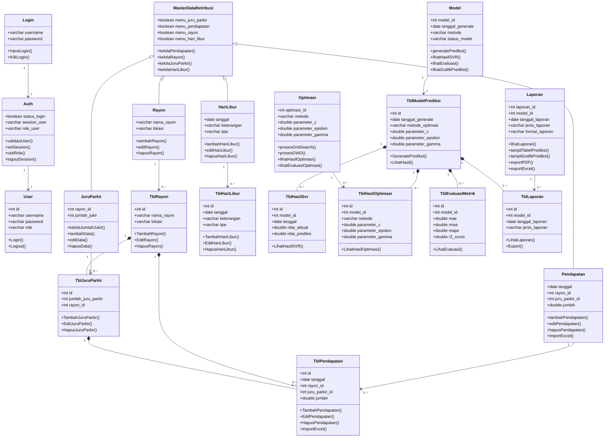

# Arsitektur Sistem Laravel (Frontend) - FastAPI (Backend)

## Sistem Prediksi Pendapatan Retribusi Parkir Menggunakan SVR + Grid Search + GWO

Dokumen ini menjelaskan rancangan struktur kode, pemisahan tanggung jawab (_separation of concerns_), pembagian hak akses aktor, rancangan _service layer_, dan sistem _routing_ pada aplikasi Laravel yang bertindak sebagai _interface/frontend_ utama sistem.

---

## 1. Konsep Desain Arsitektur (_Decoupled Architecture_)

Sistem ini menggunakan pola arsitektur terpisah di mana **Laravel** bertugas mengelola interaksi pengguna, hak akses aktor, data relasional di **MySQL**, serta pembuatan dokumen laporan. Di sisi lain, **FastAPI** bertindak sebagai server komputasi machine learning independen yang diakses melalui protokol REST API.

```
       [ Client / Browser ]
                │
                ▼
      ┌───────────────────┐
      │  Laravel Frontend │ <─── CRUD / Auth ───> [ Database MySQL ]
      └───────────────────┘
                │
         ( REST API Calls )
                │
                ▼
      ┌───────────────────┐
      │  FastAPI Backend  │ <─── Muat Dataset ───> [ File CSV / Model .pkl ]
      └───────────────────┘
```

Untuk menjaga kerapian dan kemudahan pemeliharaan kode, pengembangan Laravel mengikuti prinsip:

1. **Controller Tipis (_Thin Controller_)**: Controller hanya bertugas menerima _request_, memvalidasi data input awal, memanggil kelas _Service_ yang relevan, lalu mengembalikan visualisasi _View_ atau berkas unduhan.
2. **Service Layer**: Logika integrasi ke FastAPI, pemrosesan data untuk dashboard, pengolahan laporan, dan alur bisnis disimpan dalam folder `app/Services/`.
3. **Pemisahan Berdasarkan Peran (Role-Based Folder)**: Berkas Controller dan View dipisah secara fisik ke dalam folder peran masing-masing (_Operator_, _Kepala UPT_, dan _Kepala Dishub_) guna menghindari kebocoran hak akses.

---

## 2. Struktur Folder Proyek Laravel

Berikut adalah rancangan struktur direktori Controller, Service, dan View yang diimplementasikan pada Laravel:

```
app/
├── Http/
│   └── Controllers/
│       ├── Auth/
│       │   └── AuthController.php
│       │
│       ├── Operator/
│       │   ├── OperatorDashboardController.php
│       │   ├── MasterData/
│       │   │   ├── PendapatanController.php
│       │   │   ├── RayonController.php
│       │   │   ├── JuruParkirController.php
│       │   │   └── HariLiburController.php
│       │   ├── OperatorPrediksiController.php
│       │   ├── OperatorOptimasiController.php
│       │   └── OperatorLaporanController.php
│       │
│       ├── KepalaUpt/
│       │   ├── KepalaUptDashboardController.php
│       │   ├── KepalaUptPrediksiController.php
│       │   ├── KepalaUptOptimasiController.php
│       │   └── KepalaUptLaporanController.php
│       │
│       └── KepalaDishub/
│           ├── KepalaDishubDashboardController.php
│           ├── KepalaDishubPrediksiController.php
│           ├── KepalaDishubOptimasiController.php
│           └── KepalaDishubLaporanController.php
│
└── Services/
    ├── FastApiService.php
    ├── PredictionService.php
    ├── OptimizationService.php
    ├── DashboardService.php
    └── ReportService.php

resources/
└── views/
    ├── auth/
    │   └── login.blade.php
    ├── operator/
    │   ├── dashboard.blade.php
    │   ├── master-data/
    │   │   ├── pendapatan/
    │   │   ├── rayon/
    │   │   ├── juru-parkir/
    │   │   └── hari-libur/
    │   ├── prediksi.blade.php
    │   ├── optimasi.blade.php
    │   └── laporan.blade.php
    ├── kepala-upt/
    │   ├── dashboard.blade.php
    │   ├── prediksi.blade.php
    │   ├── optimasi.blade.php
    │   └── laporan.blade.php
    └── kepala-dishub/
        ├── dashboard.blade.php
        ├── prediksi.blade.php
        ├── optimasi.blade.php
        └── laporan.blade.php
```

---

## 3. Penjelasan Fungsi Controller per Aktor

### 3.1. Kelompok Otentikasi (`Controllers/Auth`)

- **`AuthController.php`**: Mengontrol halaman masuk login (memproses inputan _Username_ dan _Password_) serta fungsi _logout_ pengguna. Setelah login sukses, dilakukan pengecekan relasi role untuk meredireksi aktor ke dashboard masing-masing.

### 3.2. Kelompok Operator UPT Parkir (`Controllers/Operator`)

- **`OperatorDashboardController.php`**: Menampilkan metrik operasional harian, status sinkronisasi master data, dan log pelatihan model terakhir.
- **`MasterData/PendapatanController.php`**: Mengontrol manipulasi data pendapatan parkir harian, dilengkapi metode `import()` untuk mengunggah berkas Excel/CSV ke database MySQL.
- **`MasterData/RayonController.php`**: Mengelola entri data wilayah Rayon parkir.
- **`MasterData/JuruParkirController.php`**: Mengelola data administratif petugas juru parkir per wilayah Rayon.
- **`MasterData/HariLiburController.php`**: Mengelola penandaan tanggal libur nasional dan akhir pekan.
- **`OperatorPrediksiController.php`**: Menyediakan formulir masukan hyperparameter manual ($C, \epsilon, \gamma$) untuk memicu pelatihan model SVR pada FastAPI melalui REST API, serta memuat visualisasi grafik hasil pelatihan.
- **`OperatorOptimasiController.php`**: Mengontrol eksekusi otomatis optimasi hyperparameter berbasis Grid Search atau GWO yang diproses secara asynchronous pada FastAPI backend.
- **`OperatorLaporanController.php`**: Memfasilitasi operator untuk mengunduh laporan ringkas maupun tabel data detail prediksi dalam format PDF dan Excel.

### 3.3. Kelompok Kepala UPT Parkir (`Controllers/KepalaUpt`)

- **`KepalaUptDashboardController.php`**: Menampilkan ringkasan visual realisasi retribusi parkir berjalan dan rata-rata akurasi prediksi model.
- **`KepalaUptPrediksiController.php`**: Memanggil data grafik dan metrik evaluasi hasil prediksi SVR tanpa opsi untuk memicu/menjalankan pelatihan model baru (_Read-only_).
- **`KepalaUptOptimasiController.php`**: Menampilkan riwayat hasil optimasi model (perbandingan parameter awal vs parameter optimasi GWO) untuk kebutuhan pengawasan.
- **`KepalaUptLaporanController.php`**: Menghasilkan dokumen laporan pemantauan retribusi berkala dalam format PDF.

### 3.4. Kelompok Kepala Dishub (`Controllers/KepalaDishub`)

- **`KepalaDishubDashboardController.php`**: Menampilkan dashboard eksekutif berupa tren pendapatan tahunan, capaian PAD Dishub, dan diagram kontribusi pendapatan per Rayon.
- **`KepalaDishubPrediksiController.php`**: Memuat visualisasi grafik hasil proyeksi pendapatan ke depan guna mendukung formulasi kebijakan tarif atau zonasi parkir.
- **`KepalaDishubOptimasiController.php`**: Menampilkan hasil komparasi peningkatan akurasi model hasil optimasi sebagai bukti ilmiah keandalan sistem peramalan.
- **`KepalaDishubLaporanController.php`**: Mengunduh berkas laporan resmi _Laporan Prediksi Pendapatan Retribusi_ berformat PDF.

---

## 4. Penjelasan Fungsi Service Layer (`Services/`)

Untuk memastikan kepatuhan pada prinsip _Separation of Concerns_, seluruh komunikasi API dan kalkulasi logika bisnis diisolasi ke dalam kelas layanan berikut:

### 4.1. `FastApiService.php`

Layanan sentral yang bertindak sebagai _REST API client_ untuk berkomunikasi ke backend FastAPI Python.

- Menggunakan HTTP Client bawaan Laravel (`Illuminate\Support\Facades\Http`).
- Menyertakan Header keamanan seperti API token pengenal (_Secret Key_) atau JWT.
- Menyediakan fungsi dasar untuk:
  - Mengirim data pendapatan untuk pelatihan model SVR (`POST /predict/train`).
  - Mengirim parameter batas optimasi untuk Grid Search (`POST /optimize/grid-search`) dan GWO (`POST /optimize/gwo`).
  - Mengambil berkas hasil evaluasi model atau data koordinat grafik.

### 4.2. `PredictionService.php`

Mengoordinasi alur transaksi prediksi data.

- Berinteraksi dengan `FastApiService` untuk memicu training model SVR.
- Menyimpan metrik evaluasi hasil training ($MAE, RMSE, MAPE, R^2$) dari FastAPI ke tabel histori model di database MySQL.
- Mempersiapkan format data koordinat grafik (aktual vs prediksi) agar siap dibaca oleh pustaka grafik di frontend Laravel.

### 4.3. `OptimizationService.php`

Mengelola alur pemrosesan optimasi hyperparameter.

- Mengatur payload data dan batas atas/bawah parameter sebelum dikirim ke endpoint optimasi FastAPI.
- Menangani log hasil iterasi optimasi.
- Menyimpan hasil parameter optimal ($C_{opt}, \epsilon_{opt}, \gamma_{opt}$) ke MySQL untuk dijadikan parameter model aktif.

### 4.4. `DashboardService.php`

Menyediakan agregasi data statistik untuk mempercepat rendering halaman dashboard.

- Melakukan query data harian, mingguan, dan bulanan dari database MySQL.
- Mengonversi struktur data database relasional menjadi format JSON terstruktur sesuai kebutuhan masing-masing dashboard aktor (Operator, Kepala UPT, Kepala Dishub).

### 4.5. `ReportService.php`

Layanan khusus pengeksporan laporan sistem.

- Menggunakan pustaka pihak ketiga Laravel seperti `Barryvdh\DomPDF` untuk merender halaman HTML menjadi berkas PDF formal.
- Menggunakan `Maatwebsite\Excel` untuk mengekspor tabel data numerik ke lembar kerja Excel.
- Mengatur template visual kop surat dinas dan struktur tabel laporan.

---

## 5. Struktur Routing (`routes/web.php`)

Routing dikelompokkan menggunakan _Route Prefix_, _Route Name_, dan _Middleware_ keamanan berbasis peran (_role_):

```php
use App\Http\Controllers\Auth\AuthController;
use App\Http\Controllers\Operator\OperatorDashboardController;
use App\Http\Controllers\Operator\MasterData\PendapatanController;
use App\Http\Controllers\Operator\MasterData\RayonController;
use App\Http\Controllers\Operator\MasterData\JuruParkirController;
use App\Http\Controllers\Operator\MasterData\HariLiburController;
use App\Http\Controllers\Operator\OperatorPrediksiController;
use App\Http\Controllers\Operator\OperatorOptimasiController;
use App\Http\Controllers\Operator\OperatorLaporanController;

use App\Http\Controllers\KepalaUpt\KepalaUptDashboardController;
use App\Http\Controllers\KepalaUpt\KepalaUptPrediksiController;
use App\Http\Controllers\KepalaUpt\KepalaUptOptimasiController;
use App\Http\Controllers\KepalaUpt\KepalaUptLaporanController;

use App\Http\Controllers\KepalaDishub\KepalaDishubDashboardController;
use App\Http\Controllers\KepalaDishub\KepalaDishubPrediksiController;
use App\Http\Controllers\KepalaDishub\KepalaDishubOptimasiController;
use App\Http\Controllers\KepalaDishub\KepalaDishubLaporanController;

// Rute Publik (Authentication)
Route::get('/login', [AuthController::class, 'showLoginForm'])->name('login');
Route::post('/login', [AuthController::class, 'login']);
Route::post('/logout', [AuthController::class, 'logout'])->name('logout');

// Rute Khusus Operator UPT Parkir
Route::prefix('operator')->middleware(['auth', 'role:operator'])->name('operator.')->group(function () {
    Route::get('/dashboard', [OperatorDashboardController::class, 'index'])->name('dashboard');

    // Master Data
    Route::resource('/master-data/pendapatan', PendapatanController::class);
    Route::post('/master-data/pendapatan/import', [PendapatanController::class, 'import'])->name('pendapatan.import');
    Route::resource('/master-data/rayon', RayonController::class);
    Route::resource('/master-data/juru-parkir', JuruParkirController::class);
    Route::resource('/master-data/hari-libur', HariLiburController::class);

    // Proses Model SVR
    Route::get('/prediksi', [OperatorPrediksiController::class, 'index'])->name('prediksi.index');
    Route::post('/prediksi/jalankan-svr', [OperatorPrediksiController::class, 'runSvr'])->name('prediksi.run-svr');

    // Proses Optimasi
    Route::get('/optimasi', [OperatorOptimasiController::class, 'index'])->name('optimasi.index');
    Route::post('/optimasi/grid-search', [OperatorOptimasiController::class, 'runGridSearch'])->name('optimasi.grid-search');
    Route::post('/optimasi/gwo', [OperatorOptimasiController::class, 'runGwo'])->name('optimasi.gwo');

    // Modul Laporan
    Route::get('/laporan', [OperatorLaporanController::class, 'index'])->name('laporan.index');
    Route::get('/laporan/export-pdf', [OperatorLaporanController::class, 'exportPdf'])->name('laporan.export-pdf');
    Route::get('/laporan/export-excel', [OperatorLaporanController::class, 'exportExcel'])->name('laporan.export-excel');
});

// Rute Khusus Kepala UPT Parkir
Route::prefix('kepala-upt')->middleware(['auth', 'role:kepala_upt'])->name('kepala-upt.')->group(function () {
    Route::get('/dashboard', [KepalaUptDashboardController::class, 'index'])->name('dashboard');

    // Memantau Hasil
    Route::get('/prediksi', [KepalaUptPrediksiController::class, 'index'])->name('prediksi.index');
    Route::get('/optimasi', [KepalaUptOptimasiController::class, 'index'])->name('optimasi.index');

    // Unduh Laporan (PDF Saja)
    Route::get('/laporan', [KepalaUptLaporanController::class, 'index'])->name('laporan.index');
    Route::get('/laporan/export-pdf', [KepalaUptLaporanController::class, 'exportPdf'])->name('laporan.export-pdf');
});

// Rute Khusus Kepala Dishub
Route::prefix('kepala-dishub')->middleware(['auth', 'role:kepala_dishub'])->name('kepala-dishub.')->group(function () {
    Route::get('/dashboard', [KepalaDishubDashboardController::class, 'index'])->name('dashboard');

    // Memantau Proyeksi & Evaluasi
    Route::get('/prediksi', [KepalaDishubPrediksiController::class, 'index'])->name('prediksi.index');
    Route::get('/optimasi', [KepalaDishubOptimasiController::class, 'index'])->name('optimasi.index');

    // Unduh Laporan Eksekutif (PDF Saja)
    Route::get('/laporan', [KepalaDishubLaporanController::class, 'index'])->name('laporan.index');
    Route::get('/laporan/export-pdf', [KepalaDishubLaporanController::class, 'exportPdf'])->name('laporan.export-pdf');
});
```

---

## 6. Rancangan Class Diagram & Skema Database

Berikut adalah rancangan *Class Diagram* yang merepresentasikan hubungan antara kelas-kelas modul program (Controller/Service) dengan tabel fisik di database MySQL:



