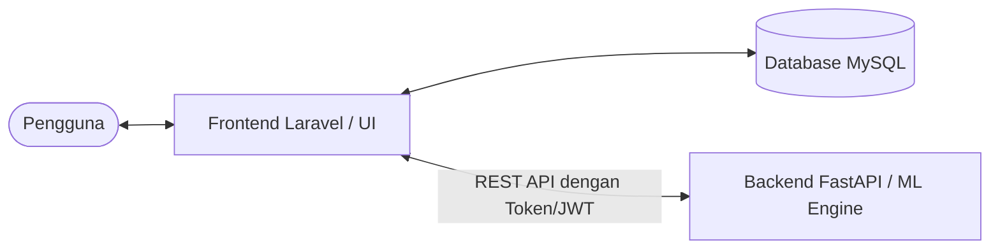

# Product Requirement Document (PRD)
## Sistem Prediksi Pendapatan Retribusi Parkir Menggunakan Support Vector Regression (SVR) dengan Optimasi Grid Search dan Grey Wolf Optimizer (GWO) pada Dinas Perhubungan Kota Cirebon

---

## 1. Pendahuluan dan Latar Belakang
Pendapatan retribusi parkir merupakan salah satu sumber Pendapatan Asli Daerah (PAD) yang potensial bagi Kota Cirebon. Dinas Perhubungan (Dishub) Kota Cirebon, melalui Unit Pelaksana Teknis (UPT) Parkir, bertanggung jawab untuk mengelola, mengawasi, dan mengoptimalkan penerimaan retribusi ini. Namun, fluktuasi pendapatan harian yang dipengaruhi oleh berbagai faktor temporal sering kali menyulitkan perencanaan target dan pengambilan kebijakan strategis.

Untuk mengatasi permeability tersebut, diperlukan sebuah sistem komputasi cerdas yang mampu memprediksi tren pendapatan retribusi parkir secara akurat. Sistem ini mengimplementasikan metode **Support Vector Regression (SVR)**, sebuah algoritma machine learning yang andal untuk data runtun waktu (time series). Guna meningkatkan akurasi prediksi, sistem ini dilengkapi dengan dua metode optimasi hyperparameter, yaitu **Grid Search** dan **Grey Wolf Optimizer (GWO)**. 

Secara arsitektural, sistem ini dibangun secara terpisah (decoupled architecture) dengan menggabungkan **Laravel** sebagai *frontend/interface* utama dan **FastAPI (Python)** sebagai *computational backend* untuk pemrosesan machine learning. Kombinasi ini menjamin antarmuka pengguna yang responsif serta pemrosesan data AI yang cepat dan modular.

---

## 2. Tujuan Sistem
Sistem ini dirancang untuk mencapai beberapa tujuan utama sebagai berikut:
1. Menyediakan platform berbasis web bagi UPT Parkir untuk mendokumentasikan dan memantau pendapatan retribusi parkir harian secara terorganisir.
2. Mengotomatisasi proses peramalan (prediksi) pendapatan retribusi parkir harian per Rayon menggunakan metode SVR.
3. Mengoptimalkan kinerja model SVR secara dinamis melalui fitur pencarian hyperparameter terbaik menggunakan Grid Search dan GWO.
4. Menyajikan visualisasi data historis dan hasil prediksi dalam bentuk grafik interaktif yang mudah dipahami.
5. Memfasilitasi proses pelaporan pendapatan dan hasil prediksi untuk kebutuhan operasional maupun pengambilan keputusan strategis oleh pimpinan Dishub.

---

## 3. Aktor Sistem dan Hak Akses
Sistem memiliki tiga aktor utama dengan tingkat otorisasi dan aksesibilitas fitur yang disesuaikan berdasarkan peran kerja masing-masing.

### 3.1. Operator UPT Parkir
Aktor teknis yang bertanggung jawab penuh atas pengelolaan data dasar dan operasional model kecerdasan buatan.
* **Fitur Login**: Akses ke dalam sistem dengan menginputkan *Username* dan *Password*.
* **Dashboard Operator**: Memantau ringkasan entri data terbaru dan status fungsional backend.
* **Kelola Master Data**: Hak akses penuh (Create, Read, Update, Delete) untuk data Pendapatan (termasuk fitur *Import Excel*), data Rayon, data Juru Parkir, serta data Hari Libur & Weekend.
* **Kelola Model Prediksi**: Menjalankan pelatihan model (*Jalankan Model SVR*) dengan input parameter manual ($C, \epsilon, \gamma$), melihat hasil evaluasi metrik, serta grafik hasil prediksi SVR.
* **Jalankan Optimasi Parameter**: Menentukan batasan parameter, mengeksekusi proses optimasi menggunakan Grid Search maupun GWO, serta memantau hasil akhirnya.
* **Kelola Laporan**: Mengakses visualisasi grafik, tabel data prediksi, serta mengekspor dokumen laporan dalam format PDF dan Excel.

### 3.2. Kepala UPT Parkir
Aktor manajerial tingkat menengah yang berfokus pada pemantauan operasional dan akurasi model.
* **Fitur Login**: Akses ke dalam sistem dengan menginputkan *Username* dan *Password*.
* **Dashboard Monitoring**: Memantau statistik realisasi retribusi harian dan bulanan.
* **Lihat Hasil Prediksi**: Memantau hasil dari model prediksi (*Lihat Hasil SVR*) yang mencakup evaluasi metrik akurasi serta grafik perbandingan data aktual vs prediksi.
* **Lihat Hasil Optimasi**: Memantau perbandingan hasil optimasi parameter, grafik optimasi, dan metrik evaluasi terbaik.
* **Laporan Prediksi Pendapatan Retribusi**: Mengunduh rangkuman laporan analisis dalam format PDF.

### 3.3. Kepala Dishub
Aktor eksekutif tertinggi yang memanfaatkan hasil analisis sistem sebagai basis kebijakan daerah.
* **Fitur Login**: Akses ke dalam sistem dengan menginputkan *Username* dan *Password*.
* **Dashboard Eksekutif**: Memantau tren pendapatan secara makro, pencapaian target, dan performa retribusi antar-Rayon.
* **Lihat Hasil Prediksi**: Mengamati hasil prediksi model (*Lihat Hasil SVR*), visualisasi grafik tren masa depan, serta evaluasi metriknya.
* **Lihat Hasil Optimasi**: Mengamati hasil pengujian optimasi parameter (terutama performa SVR + GWO).
* **Laporan Prediksi Pendapatan Retribusi**: Mengunduh laporan eksekutif resmi berformat PDF.

---

## 4. Ruang Lingkup Sistem
Ruang lingkup operasional dan teknis pengembangan sistem ini meliputi:
1. **Jenis Prediksi**: Prediksi kuantitatif harian untuk total pendapatan retribusi parkir.
2. **Kategori Area**: Data pendapatan dikelompokkan dan diprediksi berdasarkan Rayon parkir yang terdaftar di Dishub Kota Cirebon.
3. **Algoritma Machine Learning**:
   - Model dasar menggunakan Support Vector Regression (SVR) kernel Radial Basis Function (RBF).
   - Optimasi hyperparameter mencakup optimasi diskrit (Grid Search) dan optimasi metaheuristik kontinu (Grey Wolf Optimizer).
4. **Teknologi Backend & Frontend**: Komputasi numerik diselesaikan di FastAPI Python, sedangkan visualisasi, otentikasi, CRUD master data, dan pengelolaan sesi pengguna ditangani oleh Laravel.
5. **Penyimpanan Data**: Database MySQL digunakan sebagai repositori data transaksi, master data, konfigurasi pengguna, dan histori log pelatihan model.

---

## 5. Kebutuhan Fungsional
Rancangan fungsi sistem terbagi berdasarkan modul aplikasi utama:

### 5.1. Modul Otentikasi
* Sistem menyediakan form login satu pintu. Login dilakukan dengan memasukkan inputan *Username* dan *Password*.
* Sistem mendeteksi peran aktor secara otomatis untuk menentukan hak akses halaman dashboard.

### 5.2. Modul Kelola Master Data (Khusus Operator UPT)
* **Kelola Data Pendapatan**: Operator dapat mengunggah lembar kerja Excel (.xlsx/.csv) melalui fitur *Import Excel* untuk memperbarui dataset pendapatan parkir secara cepat.
* **Kelola Data Rayon & Juru Parkir**: Pengelolaan entitas wilayah parkir dan pencatatan juru parkir penanggung jawab.
* **Kelola Data Hari Libur & Weekend**: Operator menandai tanggal libur nasional dan akhir pekan untuk digunakan sebagai fitur input temporal model prediksi.

### 5.3. Modul Prediksi SVR
* **Jalankan Model SVR (Operator)**: Operator dapat memasukkan nilai parameter $C$, Epsilon ($\epsilon$), dan Gamma ($\gamma$) secara manual, lalu menekan tombol latih model. FastAPI akan memproses data, melatih model SVR, menghitung metrik akurasi, dan menyimpan model berformat `.pkl`.
* **Lihat Hasil SVR (Semua Aktor)**: Menampilkan tabel hasil prediksi, visualisasi grafik garis aktual vs prediksi, dan rincian metrik akurasi.

### 5.4. Modul Optimasi Parameter
* **Jalankan Optimasi Parameter (Operator)**: Operator dapat memilih metode optimasi (Grid Search atau GWO), menentukan rentang parameter (batas bawah & batas atas), lalu memulai pencarian otomatis parameter optimal.
* **Lihat Hasil Optimasi (Semua Aktor)**: Menyajikan grafik hasil pencarian parameter terbaik beserta perbandingan peningkatan akurasi model sebelum dan sesudah dioptimasi.

### 5.5. Modul Pelaporan (Output)
* **Laporan Prediksi (Operator)**: Ekspor tabel hasil prediksi ke file Excel dan PDF.
* **Laporan Prediksi Pendapatan Retribusi (Kepala UPT & Kepala Dishub)**: Cetak laporan formal berformat PDF yang siap dilampirkan sebagai dokumen dinas.

---

## 6. Kebutuhan Non-Fungsional
* **Keamanan Komunikasi**: Integrasi pertukaran data antara Laravel (frontend) dan FastAPI (backend) dilindungi menggunakan otentikasi REST API berbasis token pengenal (*API Key*) atau enkripsi JWT (*JSON Web Token*).
* **Performa Backend**: Pemrosesan komputasi GWO yang membutuhkan waktu lama harus dibatasi dengan mekanisme *timeout* di sisi Laravel, atau diproses secara asynchronous oleh FastAPI agar tidak menyebabkan *request blocking* pada interface.
* **Target Akurasi**: Sistem harus mampu menghasilkan akurasi prediksi dengan nilai **MAPE < 15%** sebagai batas kelayakan kategori "Baik".
* **Kemudahan Penggunaan (Usability)**: Antarmuka web dibangun responsif menggunakan Laravel, dengan rendering grafik dinamis memanfaatkan pustaka JavaScript (seperti Chart.js atau ApexCharts).

---

## 7. Arsitektur Sistem
Sistem ini menggunakan arsitektur tiga lapis (*Three-Tier Architecture*) yang membagi fungsi presentasi, logika komputasi, dan penyimpanan data.

1. **Presentation & Application Layer (Laravel)**: Menangani interaksi pengguna, pengelolaan sesi (session), otentikasi pengguna, manajemen database relasional (CRUD via Eloquent ORM), serta rendering visual grafik dan laporan PDF.
2. **Computational Layer (FastAPI)**: Layanan API berbasis Python yang bertindak sebagai mesin komputasi cerdas. Menggunakan pustaka *Scikit-Learn* untuk menjalankan algoritma SVR & Grid Search, serta pustaka kustom untuk Grey Wolf Optimizer.
3. **Database Layer (MySQL)**: Berfungsi untuk menyimpan data persisten seperti kredensial akun pengguna, data rayon, data juru parkir, log transaksi pendapatan parkir harian, dan riwayat nilai parameter optimal hasil training.

---

## 8. Integrasi Laravel dan FastAPI
Komunikasi data antara Laravel dan FastAPI dilakukan menggunakan protokol HTTP melalui arsitektur REST API dengan skema sebagai berikut:

* **Proses Prediksi / Retraining**:
  1. Operator memicu perintah *Jalankan Model SVR* di Laravel dengan parameter input tertentu.
  2. Laravel mengirimkan *POST Request* berisi payload JSON (nilai parameter $C, \epsilon, \gamma$ dan data pendapatan historis) ke endpoint FastAPI dengan melampirkan API Token keamanan.
  3. FastAPI menerima data, melakukan scaling data (preprocessing), melatih model SVR, menghitung metrik evaluasi ($MAE, RMSE, MAPE, R^2$), menyimpan file model `.pkl`, dan merespons balik ke Laravel dalam format JSON.
  4. Laravel menyimpan riwayat metrik tersebut ke MySQL dan menampilkannya pada UI.
* **Proses Optimasi (GWO/Grid Search)**:
  1. Operator memicu optimasi di Laravel.
  2. Laravel mengirimkan request batas rentang parameter ke FastAPI.
  3. FastAPI mengeksekusi iterasi pencarian parameter terbaik, menghitung performa terbaik, lalu mengembalikan nilai koordinat grafik pencarian serta nilai parameter optimal ($C_{opt}, \epsilon_{opt}, \gamma_{opt}$) ke Laravel.

---

## 9. Kriteria Evaluasi Model
Untuk mengevaluasi kinerja model prediksi (SVR standar maupun setelah optimasi), sistem mengadopsi rujukan ilmiah berikut sebagai standar klasifikasi akurasi:

### Tabel 9.1. Klasifikasi Tingkat Akurasi Model Prediksi

| Metrik Evaluasi | Nilai / Range | Kriteria Klasifikasi | Referensi Akademis |
| :--- | :--- | :--- | :--- |
| **MAPE** *(Mean Absolute Percentage Error)* | $< 10\%$ | Sangat Akurat (*Excellent*) | Safira (2023) [8], Artini (2024) [12] |
| | $10\% - 20\%$ | Baik (*Good*) | Safira (2023) [8] |
| | $20\% - 50\%$ | Cukup (*Reasonable*) | Artini (2024) [12] |
| | $> 50\%$ | Buruk (*Inaccurate*) | Safira (2023) [8] |
| **$R^2$ Score** *(Coefficient of Determination)* | $0.67 - 1.00$ | Model Kuat (*Strong*) | Hair et al. (2021) [24], Kamaluddin (2025) [5] |
| | $0.33 - 0.67$ | Model Moderat | Hair et al. (2021) [24] |
| | $< 0.33$ | Model Lemah | Kamaluddin (2025) [5] |
| **RMSE** *(Root Mean Squared Error)* | $< 10\%$ dari Mean | Sangat Baik | Laila (2025) [6], Artini (2024) [12] |
| **MAE** *(Mean Absolute Error)* | Mendekati $0$ | Presisi Tinggi | Kamaluddin (2025) [5] |

*(Catatan: Nilai MSE atau Mean Squared Error dapat dihitung dan disajikan di backend sebagai metrik tambahan opsional untuk analisis).*

---

## 10. Output Sistem

Sistem menghasilkan beberapa output utama yang dapat dikelompokkan berdasarkan jenis dan alur prosesnya.

---

### 10.1. Output Prediksi Pendapatan (API Response)

Ketika Operator menjalankan prediksi melalui endpoint `POST /api/predict`, FastAPI menghasilkan respons JSON berstruktur sebagai berikut:

| Field | Tipe Data | Keterangan |
| :--- | :--- | :--- |
| `status` | `string` | Status eksekusi, bernilai `"Sukses"` jika berhasil |
| `pesan` | `string` | Pesan deskriptif hasil prediksi, contoh: *"Berhasil men-generate ramalan cuan SVR-GWO untuk 30 hari (Semua Rayon)"* |
| `total_hari_prediksi` | `integer` | Jumlah total hari yang dicakup dalam rentang prediksi |
| `estimasi_total_pendapatan` | `float` | Akumulasi total estimasi pendapatan retribusi (dalam Rupiah) sepanjang rentang tanggal yang dipilih |
| `detail_harian` | `array` | Daftar prediksi per hari, masing-masing berisi `tanggal` (format `YYYY-MM-DD`) dan `pendapatan` (nominal dalam Rupiah) |

**Parameter Input Prediksi:**
| Parameter | Tipe | Keterangan |
| :--- | :--- | :--- |
| `tanggal_mulai` | `string` | Tanggal awal periode prediksi (format `YYYY-MM-DD`) |
| `tanggal_akhir` | `string` | Tanggal akhir periode prediksi (format `YYYY-MM-DD`) |
| `daftar_libur_nasional` | `array<string>` | Daftar tanggal libur nasional dalam rentang tersebut |
| `rayon_id` | `integer` | Filter per rayon (1–5), isi `0` untuk total semua rayon |

---

### 10.2. Output Evaluasi Performa Model (Komparasi Grid Search vs GWO)

Setelah proses pelatihan model selesai, sistem menyimpan dan menampilkan metrik evaluasi komparatif dua metode optimasi. Berikut adalah hasil aktual model yang telah dilatih menggunakan data pendapatan parkir Kota Cirebon tahun 2023–2025:

| Metrik | SVR + Grid Search | SVR + GWO | Satuan |
| :--- | ---: | ---: | :--- |
| **MSE** | 41.573.578.016 | 37.639.492.081 | Rupiah² |
| **RMSE** | 203.896 | 194.009 | Rupiah |
| **MAE** | 135.957 | 130.623 | Rupiah |
| **MAPE** | 13,08% | **12,96%** | % |
| **Akurasi** | 86,92% | **87,04%** | % |
| **R² Score** | 0,9021 | **0,9114** | — |

> **Kesimpulan Evaluasi**: Model SVR dengan optimasi **Grey Wolf Optimizer (GWO)** menghasilkan performa lebih unggul dibandingkan Grid Search pada seluruh metrik. Nilai MAPE sebesar **12,96%** masuk dalam kategori **"Baik"** berdasarkan standar klasifikasi Safira (2023), dan nilai R² sebesar **0,9114** masuk dalam kategori **"Model Kuat"** berdasarkan Hair et al. (2021).

**Parameter Optimal Hasil GWO:**

| Parameter SVR | Nilai Optimal |
| :--- | :--- |
| C *(Regularization)* | 250,03 |
| ε *(Epsilon)* | 0,005366 |
| γ *(Gamma)* | 0,00446 |

---

### 10.3. Output Tampilan Antarmuka (UI Laravel)

Semua hasil prediksi dan evaluasi ditampilkan secara visual di antarmuka Laravel sesuai peran pengguna:

#### a. Halaman Prediksi SVR
- **Tabel Hasil Prediksi**: Menampilkan kolom Tanggal, Rayon, Nilai Aktual (Rp), dan Nilai Prediksi SVR (Rp) secara berdampingan untuk perbandingan langsung.
- **Grafik Aktual vs Prediksi**: Visualisasi grafik garis — garis *solid* mewakili realisasi aktual dan garis *dashed* mewakili hasil peramalan model SVR.
- **Kartu Skor Metrik (Metric Scorecard)**: Empat kartu informatif menampilkan nilai MAE, RMSE, MAPE (akurasi), dan R² dari model yang sedang aktif.

#### b. Halaman Optimasi Parameter
- **Tabel Komparasi Metode**: Tabel perbandingan hasil dua metode optimasi (Grid Search dan GWO), menampilkan kolom Metode, C, ε, γ, MAE, RMSE, MAPE, dan R² Score secara berdampingan.
- **Grafik Perbandingan Performa**: Visualisasi grafik batang yang membandingkan tingkat error (MAPE) antara SVR Default, SVR + Grid Search, dan SVR + GWO.

#### c. Dashboard
- Ringkasan statistik realisasi vs target pendapatan parkir.
- Tren pendapatan bulanan per Rayon dalam bentuk grafik interaktif.

---

### 10.4. Output Dokumen Laporan

| Jenis Laporan | Format | Penerima | Isi |
| :--- | :--- | :--- | :--- |
| Laporan Prediksi Pendapatan | PDF | Kepala UPT, Kepala Dishub | Ringkasan eksekutif tren prediksi, metrik akurasi, grafik aktual vs prediksi |
| Ekspor Data Prediksi | Excel (.xlsx) | Operator UPT Parkir | Tabel mentah hasil prediksi harian per tanggal dan rayon untuk audit internal |

---

## 11. Batasan Sistem
Demi menjaga fokus penelitian dan efisiensi komputasi model, sistem memiliki batasan sebagai berikut:
1. **Variabel Prediktor**: Prediksi hanya didasarkan pada data historis pendapatan retribusi harian dan variabel kalender temporal (Hari, Bulan, Tahun, Weekend, dan Hari Libur Nasional).
2. **Kondisi Cuaca**: Sistem tidak mempertimbangkan faktor cuaca eksternal (seperti hujan lebat atau bencana alam) yang dapat memengaruhi tingkat kunjungan kendaraan ke area parkir.
3. **Kegiatan Khusus (Special Events)**: Sistem tidak mendeteksi adanya penutupan jalan sementara, demonstrasi, atau festival/acara besar di rayon tertentu yang dapat memicu lonjakan atau penurunan pendapatan retribusi secara ekstrem.
4. **Kebijakan Tarif**: Sistem mengasumsikan struktur tarif retribusi parkir berjalan konstan sesuai peraturan daerah yang berlaku saat data diambil. Perubahan mendadak pada peraturan tarif parkir di luar sistem tidak akan langsung diprediksi akurat oleh model tanpa adanya retraining data baru.

---

## 12. Kesimpulan PRD
Dokumen Persyaratan Produk (PRD) ini merumuskan secara sistematis spesifikasi teknis dan fungsional dari **Sistem Prediksi Pendapatan Retribusi Parkir Menggunakan SVR dengan Optimasi Grid Search dan GWO pada Dinas Perhubungan Kota Cirebon**. 

Dengan membagi tanggung jawab secara jelas antara Laravel (sebagai penyaji antarmuka dan pengelola hak akses 3 aktor) serta FastAPI (sebagai pusat algoritma machine learning), sistem ini diharapkan mampu menjadi alat bantu keputusan yang valid, aman, ilmiah, serta berkontribusi nyata bagi pengawasan Pendapatan Asli Daerah (PAD) Kota Cirebon. Dokumen ini menjadi acuan mutlak bagi proses implementasi kode program selanjutnya.
